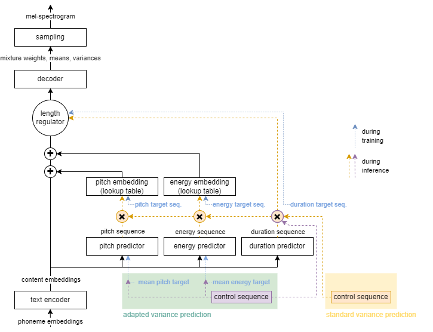

# Towards Robust FastSpeech 2 by Modelling Residual Multimodality

This is the official implementation of models and experiments for the [INTERSPEECH 2023 paper](https://arxiv.org/abs/2306.01442) "Towards Robust FastSpeech 2 by Modelling Residual Multimodality" (Kögel, Nguyen, Cardinaux 2023).

This repository contains an implementation of FastSpeech 2 with adapted variance predictors and Trivariate-Chain Gaussian Mixture Modelling (TVC-GMM) proposed in our paper.
Additionally it contains scripts to export audio and calculate metrics to recreate the experiments presented in the paper.

 

The implementation of the adapted variance prediction is located in `model/model/modules.py`, the TVC-GMM loss in `model/model/loss.py` and the sampling from TVC-GMM in `model/interactive_tts.py`.

## Setup

We recommend a virtual environment to install all dependencies (e.g. conda or venv).
Create the environment and install the requirements:

```
conda create tvcgmm python=3.8
conda activate tvcgmm

pip install -r requirements.txt
```

## Pre-trained Models

To run inference in our interactive demo and experiments it suffices to [download our pre-trained model checkpoints](https://github.com/sony/ai-research-code/releases). 
The downloaded `<checkpoint name>.zip` file contains a `40000.pth.tar` and a `used_config.yaml` which should both be placed together in the directory `output/ckpt/<checkpoint name>`. 

## Training

For re-training the model with different configurations it is necessary to obtain the datasets and run the preprocessing pipeline.
Please see the [readme](model/README.md) in the model directory for details on the FastSpeech 2 preprocessing and training.

## Interactive Demo

To run the interactive demo obtain the pre-trained model checkpoints and run:
```
cd model/
python demo.py --checkpoint <checkpoint name> [--device <cpu|cuda>] [--port <int>] [--step <int>]
```
Then access the demo in the browser at `localhost:<port>`

## Results

Please see our [project page](https://sony.github.io/ai-research-code/tvc-gmm) for audio samples and experiment results.

## Citation

If you use TVC-GMM or any of our code in your project, please cite:
```
@inproceedings{koegel23_interspeech,
  author={Fabian Kögel and Bac Nguyen and Fabien Cardinaux},
  title={{Towards Robust FastSpeech 2 by Modelling Residual Multimodality}},
  year={2023},
  booktitle={Proc. Interspeech 2023}
}
```
